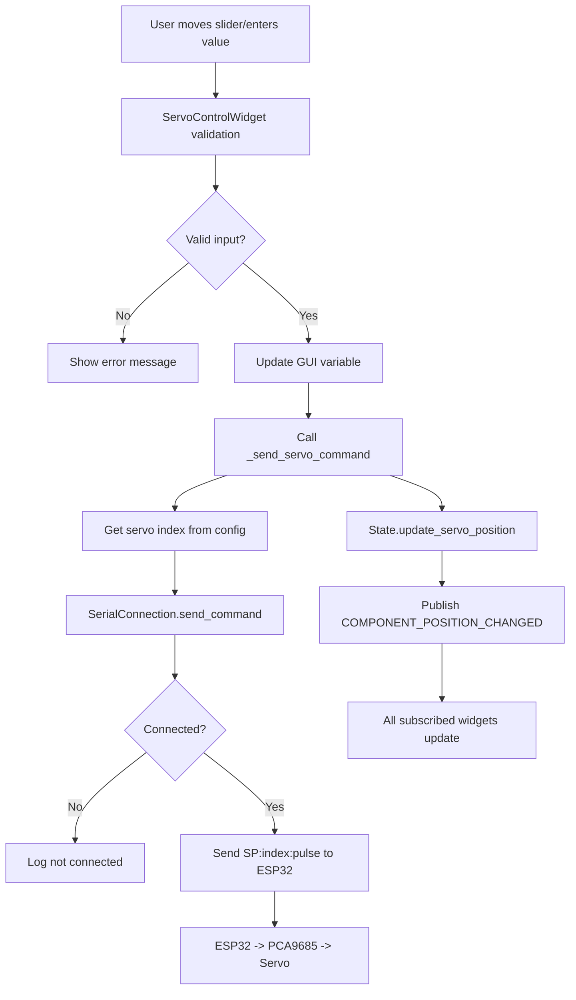
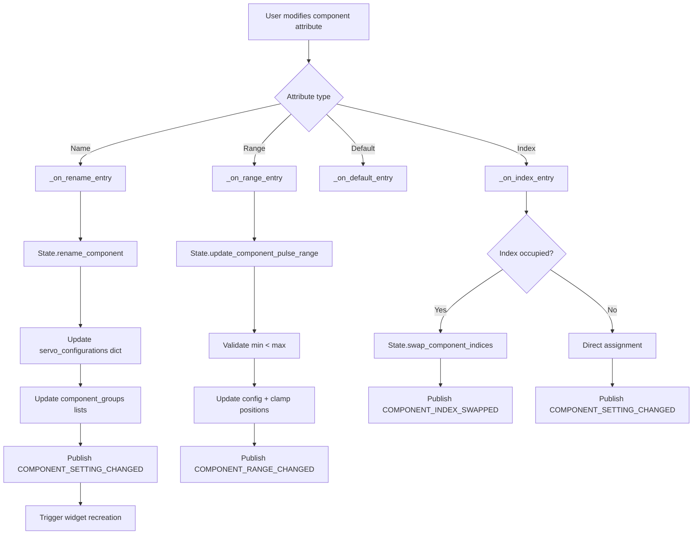
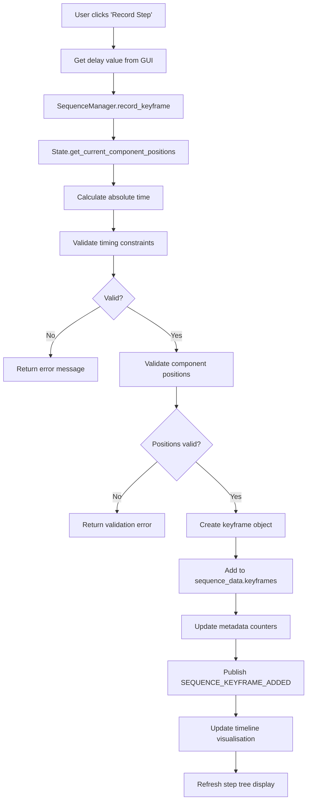
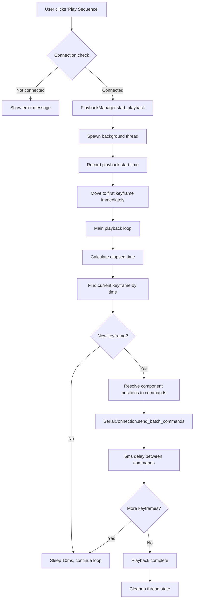
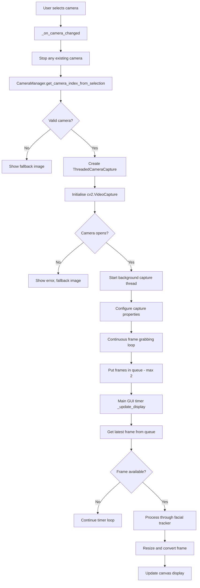
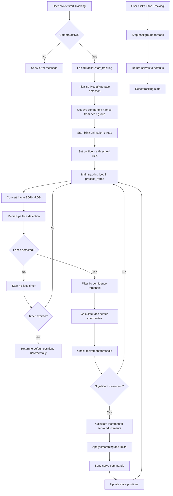
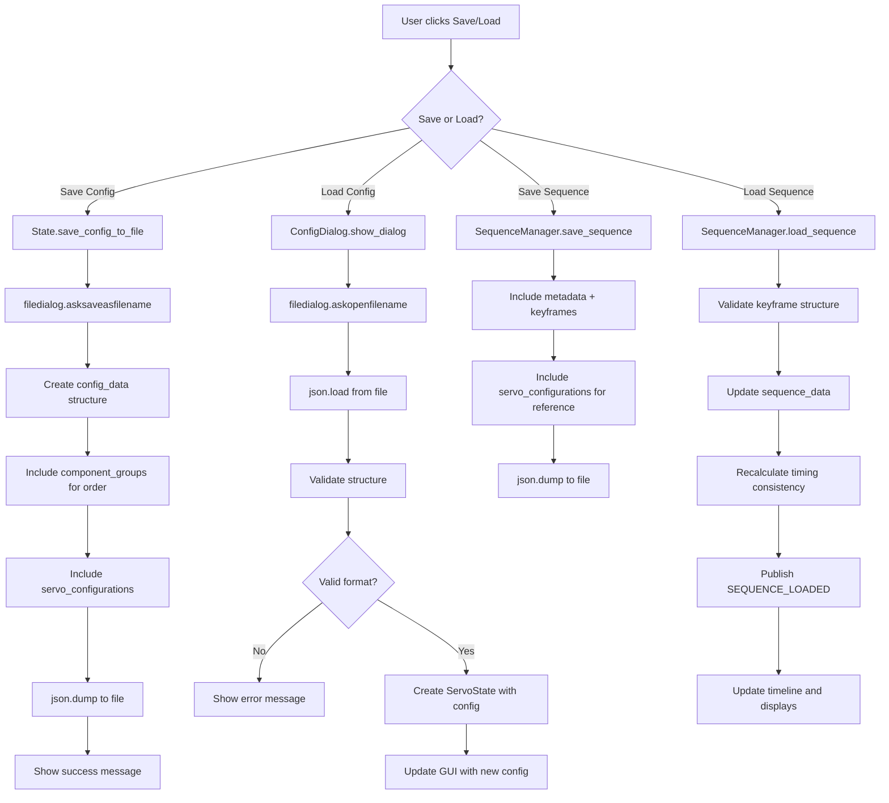

# Servo Control System - Data Flow Diagrams

## 1. General Servo Movement from Individual Controls

**Notes:**
- Slider throttling (50ms) prevents command flooding
- Range validation happens at GUI level before sending
- State updates occur regardless of connection status for GUI consistency, but none of the signals will be sent
- Event system ensures all widgets showing same component stay synchronised

---

## 2. Configuring Individual Attributes (Name Changes, etc...)

**Notes:**
- Component groups remain fixed for order authority, only names change
- Index swapping is automatic when target index is occupied

---

## 3. Sequence Recording

**Notes:**
- Time is cumulative - each keyframe has absolute time from sequence start
- Validation ensures sequence doesn't exceed 120-second, but you can easily extend or shorten this in `validation.py` from the variable `MAX_SEQUENCE_DURATION`

---

## 4. Sequence Playing

**Notes:**
- Precise timing using absolute timestamps, not cumulative delays
- Commands sent in batches with 5ms intervals to prevent ESP32 overflow
- Timeline animation plays to show progress

---

## 5. Camera Sweeping to Display

**Notes:**
- Camera enumeration limited to indices 0-2 for performance (hardware limitation)
- Background thread prevents GUI freezing during camera operations
- Camera initialisation can take 2-6 seconds during swwep, it depends on the hardware of the camera and how many cameras are connected to ur device

---

## 6. Start to Stop Facial Tracking with Servo Movement

**Notes:**
- Face detection requires 85% confidence to prevent false positives but the actual camera quality is shit... 
- Incremental position adjustment (not absolute) for smooth movement
- Multiple face switching every 8-16 seconds randomly
- Automatic return to default after 4-6 seconds of no faces
- Blink animation runs independently every 6-13 seconds

---

## 7. Loading and Saving Configs and Sequences as JSON

**Notes:**
- Config files include component groups to preserve display order
- Sequence files include servo configurations for validation reference
- Loading validates JSON structure before applying changes
- Timing recalculation ensures sequence consistency after loading